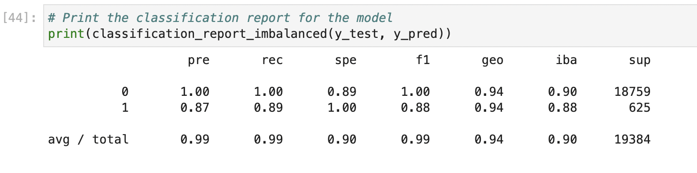
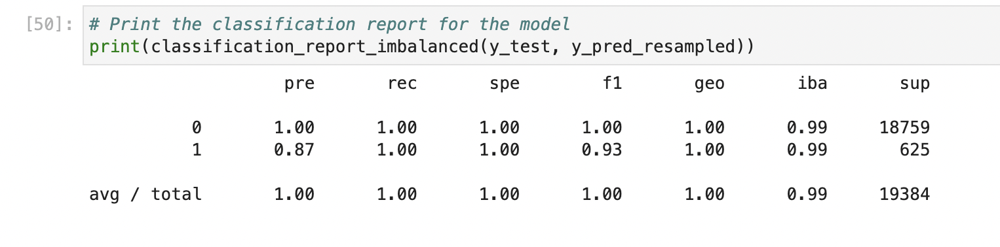

# credit_risk_resample
## credit analysis for loan applications 

---
## Technologies 

* [pandas](https://github.com/pandas-dev/pandas) - For data analysis and manipulation.
* [imblearn](https://github.com/mldataanalysis/Dealing-With-Imbalanced-Data) - For sampling 
* [numpy](https://github.com/numpy/numpy) - For scientific computing with Python
* [scikit-learn](https://github.com/scikit-learn/scikit-learn) - For ML modeling and predictions 

---

## Installation 

1. Clone the repo

         
---

## Usage

1. To run the program navigate to the repo and run the ***credit_risk_resample*** file

2. In the ***Resources*** folder you will find the database used for this analysis

3. The program will use a logisitic regression model to predict loan health based on credit score first using normally sampled data and then oversampled 

4. The used can then choose which model best fits their data or continue feature engineering 

---

## Contributors

The starter code was contributed by the [FinTech Bootcamp at Columbia Engineering](https://bootcamp.cvn.columbia.edu/fintech/)

Matthew Field finalized the application, his work is availble to view on [Github](https://github.com/mbf2139)

---

## License

MIT
